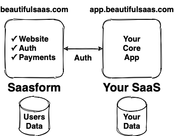

# Welcome to Saasform!

Saasform is a state-of-the-art website for your SaaS, with authentication, payments and common growth & marketing tools.

{:style="text-align: center"}

Building a SaaS requires building a website, authentication, payments… and maintaining and updating them… all distractions from your core features. Saasform pre-packages all the things you and your team need to launch faster and grow more effectively.

Saasform is built with security and usability in mind. It's a standalone service including its own datastore, i.e. it's not a boilerplate, so you can build your SaaS with the tech stack you'd like, even serverless. All you need to do is to integrate Saasform authentication in your backend or functions. This architecture is great to launch quickly, keep you focused on your core features, and maintain a good separation as your infrastructure and team scale.

{:style="text-align: center"}

